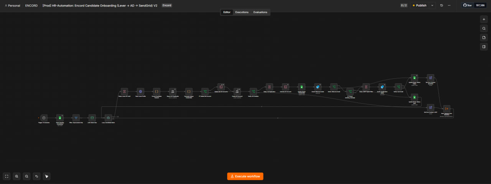
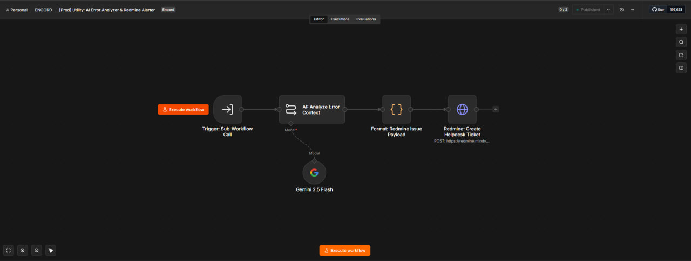
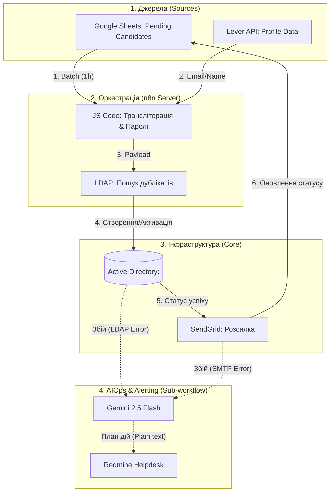

# 👔 HR-Automation: Candidate Onboarding (AD Provisioning Pipeline)

## 📋 Про проєкт

Цей автоматизований конвеєр розроблено для повного циклу онбордингу кандидатів, зводячи ручну роботу HR та IT-відділів до нуля. Завдяки синхронізації даних між Google Sheets та Lever API, система самостійно створює облікові записи в корпоративному Active Directory, генерує безпечні паролі та відправляє вітальні листи через SendGrid. Унікальною фічею пайплайну є вбудована підсистема AIOps: у разі збоїв (наприклад, помилки LDAP або поштового шлюзу), Google Gemini автоматично аналізує лог і створює зрозумілий тікет для L1 підтримки у Redmine.

## 🗺️ Загальна схема воркфлоу

### 📊 Архітектурна схема руху даних (Data Flow)

## 🚀 Архітектура та етапи роботи (Zero-waste)

Вся логіка інкапсульована в n8n з чітким поділом на основний процес та підсистему обробки помилок:

*   **Extract (Ingest):** Воркфлоу запускається щогодини, забираючи з Google Sheets лише тих кандидатів, які ще не мають згенерованого `Login AD`. Дані збагачуються через Lever API для отримання актуальної особистої пошти.
*   **Transform:** Inline JS-скрипти транслітерують кирилицю, генерують логіни (формат `firstLetter.lastName`) та створюють складні паролі з урахуванням вимог AD. Спеціальний скрипт перевіряє наявність дублікатів у LDAP і за потреби додає числові суфікси (наприклад, `_1`), обмежуючи довжину `sAMAccountName` до 20 символів.
*   **Provisioning (Load):** Створення користувача в цільовому `OU`, видалення старих акаунтів (якщо виявлено збіг пошти), пауза на реплікацію AD та виконання Bash/LDIF-команд для активації акаунта і додавання до відповідної групи безпеки.
*   **Delivery:** Відправка двох HTML-листів через SendGrid: "Welcome Guide" із доступами та "Certification Guide" з інструкціями. Фінальне оновлення статусів (`sent`/`failed`) у Google Sheets.
*   **AIOps (Error Handling):** Якщо на етапі LDAP або SendGrid стається помилка, викликається саб-воркфлоу. У ньому Gemini 2.5 Flash отримує сирий лог і формує структурований тікет (Суть, Причина, План дій) для Redmine (Tracker ID: 15) простою мовою.

## 🛠️ Стек технологій

*   **Оркестрація:** n8n (Enterprise/Self-hosted)
*   **Логіка нод:** JavaScript (ES6+), Bash, LDIF
*   **Інфраструктура:** Active Directory / LDAP
*   **AI & Аналітика:** Google Gemini 2.5 Flash (LangChain integration)
*   **Зовнішні API:** Google Sheets API, Lever API, SendGrid API, Redmine REST API

## ⚠️ Системні вимоги (Prerequisites)

Оскільки пайплайн напряму взаємодіє з корпоративною інфраструктурою, переконайтеся у виконанні таких умов:

1.  Інстанс n8n має мережевий доступ до контролера домену (IP: `<YOUR_DC_IP>`, порт `636`, протокол `ldaps`).
2.  У контейнері n8n (або на хост-машині) встановлено утиліти `ldap-utils` (зокрема `ldapdelete` та `ldapmodify`), необхідні для роботи нод Execute Command.
3.  Налаштовано змінну оточення `LDAPTLS_REQCERT=never` для коректної роботи самопідписаних сертифікатів AD (вже враховано у Bash-командах).

## ⚙️ Розгортання (Deployment)

1.  **Імпорт AIOps:** Завантажте файл `[Prod] Utility: AI Error Analyzer & Redmine Alerter.json` у ваш інстанс n8n. Збережіть та активуйте його. Занотуйте його ID.
2.  **Імпорт основного процесу:** Завантажте файл `[Prod] HR-Automation: Candidate Onboarding (Lever -> AD -> SendGrid) V2.json`.
3.  **Зв'язування:** Відкрийте ноду `Alert: Redmine Sub-Workflow` в основному процесі та виберіть воркфлоу, який ви імпортували на кроці 1.
4.  **Налаштування Credentials:**
    *   Google Sheets (OAuth2)
    *   LEVER API (Bearer Token)
    *   LDAP Service Account (LDAP)
    *   SendGrid account (API Key)
    *   Google Gemini API
    *   Redmine Prod Bot (Header: `X-Redmine-API-Key`)
5.  **Запуск:** Увімкніть воркфлоу кнопкою **Active**. Розклад встановлено на 1 годину.
